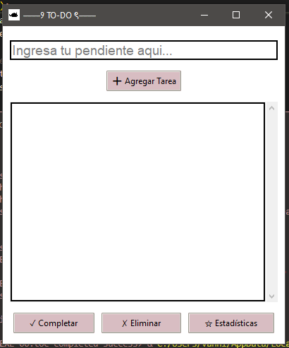

# ౨ৎ TO-DO APP ౨ৎ

## Descripción

Aplicación de lista de tareas con interfaz gráfica en Python. Diseño minimalista en tonos rosados para gestionar tus pendientes diarios.

## Características

- ✓ Agregar y eliminar tareas
- ✓ Marcar tareas como completadas
- ✓ Estadísticas de progreso
- ✓ Guardado automático en JSON
- ✓ Atajo: Enter para agregar tareas

## Requisitos

```
Python 3.x
tkinter
```

## Instalación y Uso

```bash
python todo_app.py
```

Opcionalmente, incluye un archivo `icon.ico` en el mismo directorio.

## Funcionalidades

**Agregar** → Escribe y presiona Enter o clic en el botón

**Completar** → Selecciona una tarea y clic en ✓ Completar

**Eliminar** → Selecciona una tarea y clic en ✗ Eliminar

**Estadísticas** → Clic en ☆ Estadísticas para ver resumen

## Archivos

```
main.py          # Archivo principal
tasks.json           # Datos (auto-generado)
icon.ico             # Icono opcional
```

───୨୧───


